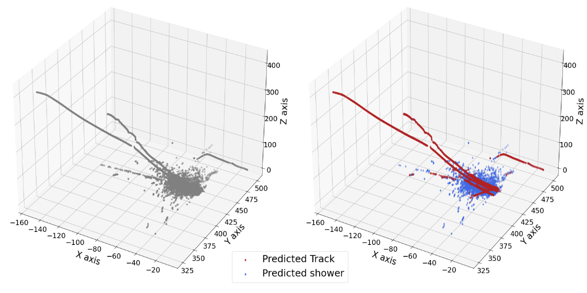

# Sparse Convolutional Neural Networks for particle classification 


 - Author: **Adam Abed Abud**
 - Last update: February 15, 2023

Paper: **Sparse Convolutional Neural Networks for particle classification in ProtoDUNE-SP events** 

Proceedings of the conference Advanced Computing and Analysis Techniques in Physics Research (Virtual ACAT 2021, Daejeon, South Korea)

Based on previous work from Facebook AI research: Benjamin Graham and Laurens van der Maaten. “**Submanifold Sparse Convolutional  Networks**”. In:  CoRR  abs/1706.01307 (2017). [arXiv:  1706.01307](http://arxiv.org/abs/1706.01307)

**Technology:** `Deep Learning`, `Computer Vision`, `PyTorch`, `Physics research`

## Introduction 

Code shows the use of Submanifold Sparse Convolutional Neural Networks (SparseNets) for the classification of track and shower hits from a prototype experiment based on liquid-argon detector at CERN.

Submanifold sparse convolutional neural networks (SparseNet) are a class of Deep Learning methods primarily designed for 3D image reconstruction, image completion or semantic segmentation problems. The SparseNet has proven to be quite effective when dealing with sparse data and with potentially minimal resource utilization compared to other classes of CNNs. The three-dimensional hits produced in the detector at CERN (ProtoDUNE-SP) are well suited for the SparseNet algorithm as they are locally dense and sparsely located in the detector volume. Moreover, the computational benefit of utilizing the SparseNet may also be more relevant for larger LArTPC detectors such as the planned DUNE experiment.

The SparseNet has been trained on a test sample and shows promising results: efficiencies and purities greater than 90\%. This has also been achieved with a considerable speedup and substantially less resource utilization with respect to other DL networks such as graph neural networks. 

## Network architecture
 
For the purpose of this research, the SparseNet was used to perform the classification task of distinguishing between two physics objects: track hits and shower hits. A softmax activation function and a Stochastic gradient descent (SGD) optmizer have been used in the SparseNet. The output of the network is a score ranging from 0 for track objects and 1 for shower objects. In addition, the Minkoski Engine (NVIDIA) was used to support the operations of convolution and pooling that are needed by the computation with sparse networks. 

For the ML training and validation, more than 2M hits have been processed. In total, 9 features were selected: charge deposition of each spacepoint; angle and dot product between two neighboring spacepoints; number of neighboring spacepoints as well as the total charge within a distance of 3 cm, 10 cm and 30 cm.


As a comparison, a collection of classification algorithms not based on neural networks (e.g. Logistic Regression, Decision Tree, K-Nearest Neighbours, Gaussian Naive Bayes, Random Forest, etc.) have been tested on the same dataset. 


## Project Organization
----


    ├── README.md                             <- README file for developers using this project.
    |
    ├── ML_feature_analysis.ipynb             <- Feature engineering 
    |
    ├── training.ipynb                        <- Training step
    │
    ├── ML_algo_comparison.ipynb              <- Comparison of different algos 
    │
    ├── ML_XGboost.ipynb                      <- Use of the XGboost classification algorithm
    │
    ├── MC_inference_THESIS_results.ipynb     <- Inference step on simulated data
    │
    └── protodune_sparse_40k_sample.ipynb     <- Inference step on real physics data 


## Prerequisites 

Install the the Minkowski Engine 

```sh
pip3 install -U git+https://github.com/NVIDIA/MinkowskiEngine -v --no-deps  --install-option="--cpu_only" --install-option="--blas=openblas"
```


# Results
----

Applying the algorithm on the real data we get the following results: 
```sh
              precision    recall  f1-score   support

       track      0.956     0.953     0.955   1046808
      shower      0.915     0.921     0.918    577258

    accuracy                          0.941   1624066
   macro avg      0.936     0.937     0.936   1624066
weighted avg      0.942     0.941     0.942   1624066

```
 

  
  

License
----

**Free Software!** 
For the benefit of everyone.

